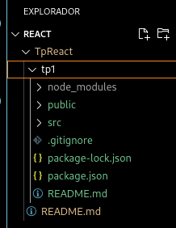

# <strong style='color:hsl(120,100%,25%)'>TpReact</strong>

### Integrantes
#### Urra Juan Pablo FAI 3730 - Insua Francisco FAI 3013 - Casimiro Alexis FAI 4224

## Objetivo:
Aprender el uso de la libreria React en un proyecto.

## Conocimientos Necesarios

## Herramientas Necesarias 
1. Editor de codigo (recomenddo Vscode)[Descargar Vscode](https://code.visualstudio.com/download).
2. npm (Gestor de paquetes NodeJs). Si instalas NodeJs incluye npm. [Descargar NodeJs](https://nodejs.org/en/download).

# <strong style='color:hsl(240,100%,50%)'>Instalacion React</strong>
Una vez isntalado tu editor de codigo y NodeJs, puedes verificar la instalacion en la terminal (**Linux**)("npm -v" y "node -v"), o cmd (**Windows**)("npm --version" y "node --version").

### Pasos para la instalacion de React
1. Abre **Vscode** y su terminal. Crea un directorio con el nombre del proyecto.
2. Ingresa al directorio creado (cd nombreProyecto) y ejecuta el siguiente comando. **npx create-react-app nombreProyecto**.
3. Luego de esperara que se instale toda la estructura de archivos, muevete a la carpeta con el nombre del proyecto. 
4. Ejecuta el comando **npm start**.
5. Si todo funcionacorrectamente, se abrira el navegador con el logo de React.

## Conceptos Utiles
Al abrir el proyecto en Vscode veran una imagen similar es esta. 

## Directorios 
### src
Contiene los archivos que se modificar o gregar para realizar una pagina personalizada en React. Son de extension css y js.
### public
Contiene el archivo html que hace de "puerta de entrada" para que la aplicacion se vea en una navegador. 
### node_modules
Es el corazon de React. Tiene todos los archivos necesarios para su funcionamiento. Se recomienda NO modificar estos archivos a menos que sea un usuario con experiencia en React. 

## Archivos
### <strong style='color:hsl(120,100%,25%)'>Package.json</strong>
Es un archivos JSON que contienen los metadatos relacionados al proyecto. Este se usa para proveer la informacion al npm que permite identificar el proyecto y sus dependencias. 

### <strong style='color:hsl(60,100%,25%)'>index.js</strong>
Este archivo se encuentra dentro de **src** y es la base para la ejecucion del proyecto. Lo importante de este archivo es el metodo **ReactDOM.render()**. Este se encarga de renderizar y mostrar el contenido en el navegador. Toma 2 parametros, el primero es crear un elemento con el id **root** que se encuentra en index.html y el segundo es llamar a los componentes de la aplicacion dentro del archivo App.js.

### <strong style='color:hsl(60,100%,25%)'>App.js</strong>
Aqui enontraras un funcion con la sentencia "return", donde se encuentra el codigo en **JSX** para crear los componentes necesarios para tu proyecto.   Cabe aclarar que existen 2 sentencias importantes para la comunicacion entre los distintos archivos. Estos son **export** que se usa para que otro archivo lo pueda utilizar y **import** para usar un archivo externo dentro de otro. 
### <strong style='color:hsl(240,100%,50%)'>index.css</strong>
Este archivo se encarga de dar estilo a la pagina principal de tu proyecto, que su vez es llamado desde "index.js", la cual llama a la funcion "App" donde se escribe el codigo **JSX**. 

